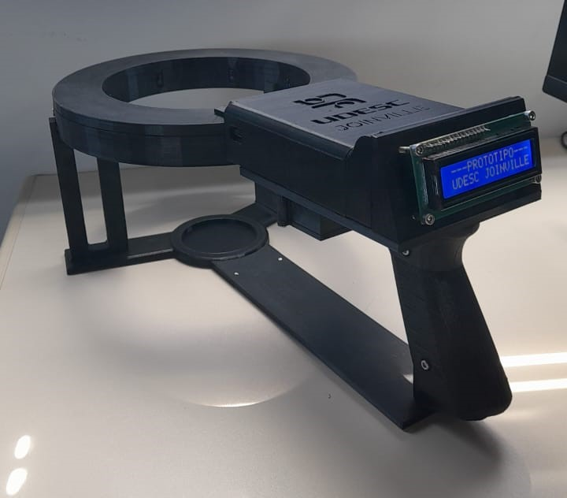

# Craniômetro Digital - Projeto de Pesquisa UDESC (CCT & CEFID)

## Sobre o Projeto

Este repositório contém o desenvolvimento de um craniômetro digital, um protótipo inovador criado para auxiliar medições cranianas de bebês com maior precisão e eficiência em comparação com métodos manuais. O projeto é fruto de uma parceria entre a Universidade do Estado de Santa Catarina (UDESC) - Centro de Ciências Tecnológicas (CCT), Joinville, e a UDESC - Centro de Ciências da Saúde e do Esporte (CEFID). O desenvolvimento foi realizado por Gustavo de Souza e Grasiela Ferreira.

## Motivação

A medição da cabeça de bebês é um parâmetro essencial para monitoramento do crescimento e identificação de possíveis alterações no desenvolvimento craniano. Métodos tradicionais, como o uso de fita métrica, estão sujeitos a variações e imprecisões humanas. O craniômetro digital foi desenvolvido para:

Otimizar medições em clínicas e hospitais;

Reduzir erros humanos ao proporcionar um método padronizado e automatizado;

Aumentar a precisão nas medições cranianas;

Facilitar a obtenção e o registro dos dados para acompanhamento do crescimento infantil.

## Visão superior do protótipo

## Componentes Utilizados

| Componente | Descrição |
|--------------------|----------------------------------------------|
|**TCRT5000 (x8)** | Sensores infravermelhos para medir distâncias  |
|**MPU6050** | Módulo acelerômetro e giroscópio para estabilidade   |
|**Display OLED** | Exibição das medições em tempo real             |
| **Pilhas** | Alimentação portátil do equipamento                  |

## Operação do Equipamento

O funcionamento do craniômetro digital segue três etapas principais:

1. **Calibração:**

      - Antes de iniciar as medições, o equipamento passa por um processo de calibração utilizando peças impressas em 3D. Isso garante que os sensores estejam corretamente ajustados para obter medições precisas.

2. **Medição:**

      - O equipamento é posicionado ao redor da cabeça do bebê.

      - A criança utiliza uma faixa de lycra branca, o que melhora a captação das medições pelos sensores infravermelhos.

      - Os 8 sensores TCRT5000 medem as distâncias entre eles e a superfície da cabeça da criança.

      - O módulo MPU6050 auxilia na estabilização do equipamento, compensando pequenos movimentos involuntários.  

      - Os valores das medições são exibidos em tempo real no display OLED.

3. **Processamento e Armazenamento:**

      - Após a finalização da medição, os dados coletados são processados.

      - As informações são enviadas para um computador para futuras manipulações, armazenamento e exibição.

      - Isso permite a criação de um histórico de medições e facilita a análise do crescimento craniano da criança ao longo do tempo.

## Aplicações

Consultórios pediátricos e neonatais;

Hospitais e maternidades;

Pesquisas sobre desenvolvimento infantil;

Monitoramento de assimetrias cranianas.

## Licença

Este projeto é de código aberto e está disponível sob a licença MIT. Sinta-se à vontade para contribuir!
